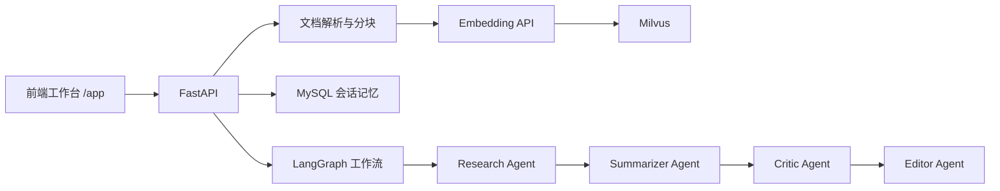

# AI Research Assistant

基于 **RAG、多智能体、LangGraph、Milvus 与 MySQL** 的多文档研究问答系统。

项目包含完整的 FastAPI 后端和 Notion 风格前端工作台。前端由 FastAPI
同源托管，因此启动后端即可使用整个应用，不需要额外启动 Node 服务。

## 功能

- 支持上传 PDF、DOCX、HTML、HTM 和 TXT。
- 自动提取文本并按 500 字符分块，相邻分块重叠 50 字符。
- 使用硅基流动 `BAAI/bge-m3` 生成 1024 维嵌入向量。
- 使用 Milvus 存储向量并执行相似度检索。
- 使用 MySQL 持久化会话和聊天历史。
- 支持指定一个或多个文档提问，也支持搜索全部文档。
- 工作流依次经过 Research、Summarizer、Critic 和 Editor Agent。
- Critic 发现缺口时自动进入 Editor，否则直接返回初稿。
- 前端展示引用来源、执行状态、工作流日志和会话历史。
- `/health` 实时检查 API Key、MySQL 和 Milvus 状态。

## 技术架构



核心链路：

```text
上传 -> 文本提取 -> 分块 -> 向量化 -> Milvus

提问 -> 读取会话上下文 -> Research -> Summarizer -> Critic -> Editor -> 回答
```

## 项目结构

```text
AI-Research-Assistant/
├── frontend/                 # 前端工作台
│   ├── index.html
│   ├── styles.css
│   └── app.js
├── backend/
│   ├── agents/               # 多智能体与 LangGraph 工作流
│   ├── db/                   # MySQL 会话记忆与 Milvus 向量存储
│   ├── models/               # Pydantic 请求和响应模型
│   ├── utils/                # 文档解析与向量化
│   ├── .env.example          # 环境变量模板
│   ├── config.py             # 配置读取
│   ├── main.py               # FastAPI 入口与前端托管
│   └── requirements.txt
├── tests/                    # 回归测试
├── run_backend.py            # 纯后端开发入口
├── run_fullstack.py          # 全栈开发入口
├── 测试文件 .pdf              # 文献综述测试文档
└── 测试问题.pdf               # 独立测试问题集
```

`.idea/runConfigurations/` 中包含两个 PyCharm 运行配置：

```text
Research Assistant Backend
Research Assistant Full Stack
```

## 环境要求

- Python 3.10 或更高版本
- MySQL 8.x
- Milvus 2.4 或更高版本
- Docker Desktop，用于运行 Milvus
- 硅基流动 API Key
- DeepSeek API Key

## 快速开始

### 1. 进入项目并安装依赖

```powershell
cd D:\python\xiangmu\AI-Research-Assistant
.\.venv\Scripts\python.exe -m pip install -r backend\requirements.txt
```

不要直接使用系统 Python 启动项目。项目依赖安装在 `.venv` 中，直接执行
`python main.py` 可能出现 `ModuleNotFoundError: No module named 'pymysql'`。

### 2. 配置环境变量

首次使用时复制配置模板：

```powershell
Copy-Item backend\.env.example backend\.env
```

在 `backend\.env` 中填写：

```env
EMBEDDING_API_KEY=硅基流动的Key
LLM_API_KEY=DeepSeek的Key
MYSQL_PASSWORD=MySQL密码
```

常用配置：

```env
EMBEDDING_MODEL=BAAI/bge-m3
EMBEDDING_BATCH_SIZE=32

LLM_MODEL=deepseek-v4-flash

MYSQL_HOST=127.0.0.1
MYSQL_PORT=3306
MYSQL_USER=root
MYSQL_DATABASE=research_assistant
MYSQL_CONNECT_TIMEOUT=3

MILVUS_URI=http://127.0.0.1:19530
MILVUS_CHUNK_COLLECTION=document_chunks
MILVUS_TIMEOUT=3
VECTOR_DIM=1024

MAX_QUERY_LENGTH=4000
MAX_TOP_K=50
MAX_DOC_IDS=100
MAX_UPLOAD_SIZE_MB=50
MAX_DOCUMENT_CHUNKS=5000
```

### 3. 启动 MySQL

确认 MySQL 服务已运行：

```powershell
Test-NetConnection 127.0.0.1 -Port 3306
```

后端首次连接时会自动创建 `research_assistant` 数据库及所需数据表。

### 4. 启动 Milvus

本机 Milvus 启动脚本：

```powershell
D:\program\docker_tool\Milvus\start_milvus.bat
```

确认端口 `19530` 可用：

```powershell
Test-NetConnection 127.0.0.1 -Port 19530
```

使用期间需要保持 Docker Desktop 运行。

## 启动方式

### 方式一：命令行全栈启动

在项目根目录执行：

```powershell
.\.venv\Scripts\python.exe run_fullstack.py
```

脚本会：

1. 启动 FastAPI。
2. 监听 `backend` 和 `frontend` 目录的文件变化。
3. 等待 `/health` 检查通过。
4. 自动打开 `http://127.0.0.1:8000/app/`。

### 方式二：PyCharm 全栈启动

1. 使用 PyCharm 打开项目目录。
2. 确认解释器是 `.venv\Scripts\python.exe`。
3. 在右上角选择 `Research Assistant Full Stack`。
4. 点击 Run。

浏览器会自动打开前端工作台。

如果 PyCharm 没有显示运行配置，可以手动创建 Python 配置：

```text
脚本：run_fullstack.py
工作目录：D:\python\xiangmu\AI-Research-Assistant
解释器：D:\python\xiangmu\AI-Research-Assistant\.venv\Scripts\python.exe
```

### 方式三：只启动后端

命令行：

```powershell
.\.venv\Scripts\uvicorn.exe backend.main:app --reload --port 8000
```

或在 PyCharm 中选择：

```text
Research Assistant Backend
```

## 访问地址

- 前端工作台：`http://127.0.0.1:8000/app/`
- Swagger API：`http://127.0.0.1:8000/docs`
- 健康检查：`http://127.0.0.1:8000/health`
- 工作流图：`http://127.0.0.1:8000/workflow/diagram`
- 根路径：`http://127.0.0.1:8000/`，自动跳转到 `/app/`

如果使用 PyCharm 内置网页服务器直接预览 `frontend/index.html`，前端会自动
把 API 请求发送到 `http://127.0.0.1:8000`。后端、MySQL 和 Milvus 仍需运行。

## 前端工作台

前端支持：

- 拖拽上传文档。
- 查看文档类型、分块数和字符数。
- 多选、全选和批量删除文档。
- 指定文档提问或搜索全部文档。
- 多轮追问和历史会话恢复。
- 展示回答引用来源。
- 展示 Research、Summarizer、Critic、Editor 执行状态。
- 展示 MySQL、Milvus 和 API Key 健康状态。
- 桌面三栏布局和移动端抽屉侧栏。

## API 一览

| 方法 | 路径 | 说明 |
| --- | --- | --- |
| GET | `/health` | 检查配置和依赖服务 |
| POST | `/upload` | 上传并向量化文档 |
| GET | `/documents` | 列出已入库文档 |
| DELETE | `/documents/{doc_id}` | 删除文档及全部分块 |
| POST | `/ask` | 执行多智能体问答 |
| POST | `/sessions/create` | 创建新会话 |
| GET | `/sessions` | 列出全部会话 |
| GET | `/sessions/{session_id}/history` | 获取会话历史 |
| DELETE | `/sessions/{session_id}` | 删除会话 |
| GET | `/workflow/diagram` | 获取 Mermaid 工作流图 |
| GET | `/stats` | 获取 MySQL 和 Milvus 统计 |
| GET | `/` | 跳转到前端工作台 |

## 上传文档

Swagger 中调用 `POST /upload`，选择 PDF、DOCX、HTML、HTM 或 TXT 文件。

命令行示例：

```powershell
curl.exe -X POST http://127.0.0.1:8000/upload `
  -F "file=@D:\资料\example.pdf"
```

响应示例：

```json
{
  "status": "uploaded",
  "doc_id": "28f6c0a1-xxxx-xxxx-xxxx-xxxxxxxxxxxx",
  "filename": "example.pdf",
  "file_type": "PDF",
  "chunks": 12,
  "characters": 5680,
  "vectors": 12
}
```

文档 ID 使用 UUID，因此同名文件不会覆盖已有文档。

## 提问

```json
POST /ask
{
  "query": "这个文档主要讲了什么？",
  "top_k": 5,
  "doc_ids": [
    "28f6c0a1-xxxx-xxxx-xxxx-xxxxxxxxxxxx"
  ],
  "session_id": null
}
```

说明：

- `doc_ids` 为 `null` 或空数组时搜索全部文档。
- `top_k` 范围为 `1` 到 `50`。
- 第一次提问可以不传 `session_id`，响应会返回新会话 ID。
- 后续追问传入返回的 `session_id` 即可保持上下文。

响应包含：

- `answer`：最终回答。
- `sources`：引用来源。
- `searched_docs`：实际搜索的文档。
- `workflow_log`：各智能体执行日志。
- `metadata`：分块数量、是否编辑和是否发现缺口。
- `session_id`：当前会话 ID。

## 测试

运行全部回归测试：

```powershell
.\.venv\Scripts\python.exe -m unittest discover -s tests -v
```

当前测试覆盖：

- 前端页面由 FastAPI 正常托管。
- 健康检查正确报告依赖异常。
- 上传大小限制。
- UUID 文档 ID。
- GBK 中文文本解析。
- 文本分块重叠规则。
- 请求参数校验。
- LangGraph 错误传播。
- 正常跳过 Editor 的工作流。

项目根目录还提供了两份可直接上传的测试资料：

- `测试文件 .pdf`
- `测试问题.pdf`

## 常见问题

### `ModuleNotFoundError: No module named 'pymysql'`

使用了系统 Python，而不是项目虚拟环境。改用：

```powershell
.\.venv\Scripts\python.exe run_fullstack.py
```

### 前端显示“后端无法连接”

确认：

- FastAPI 正在运行。
- 后端地址是 `http://127.0.0.1:8000`。
- `/health` 返回 `200`。
- 防火墙没有阻止本地端口。

推荐直接从 `http://127.0.0.1:8000/app/` 打开前端。

### `/health` 返回 `503 degraded`

查看 `checks`：

- `config` 异常：检查 `EMBEDDING_API_KEY` 和 `LLM_API_KEY`。
- `mysql` 异常：检查 MySQL 服务、用户名和密码。
- `milvus` 异常：启动 Docker Desktop 和 Milvus。

### 上传后提示“未能从 PDF 文件中提取到有效文本”

该 PDF 可能是扫描图片版，不包含可复制文字层。当前项目使用 `pdfplumber`
提取文字，不包含 OCR。请先使用 OCR 工具转换，或上传带文字层的 PDF。

### PyCharm 提示端口被占用

说明 `8000` 已被另一个 Uvicorn 或 Python 进程使用。停止之前的运行实例，
或者在 PyCharm 中使用 Stop 按钮结束旧进程。

## 运行日志

使用 `run_backend.py` 或 `run_fullstack.py` 手动重定向时会生成：

```text
backend/logs/uvicorn.out.log
backend/logs/uvicorn.err.log
```

这些文件只包含 Uvicorn 启动和 HTTP 访问记录，已被 `.gitignore` 忽略。
PyCharm 启动时，实时日志默认显示在 Run 窗口中。
